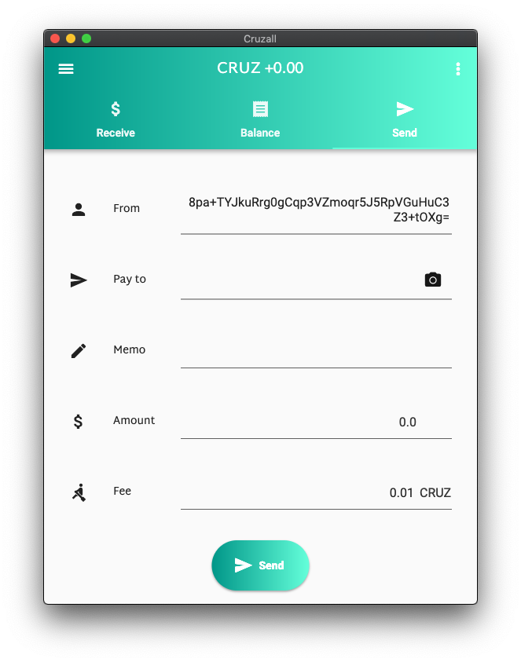
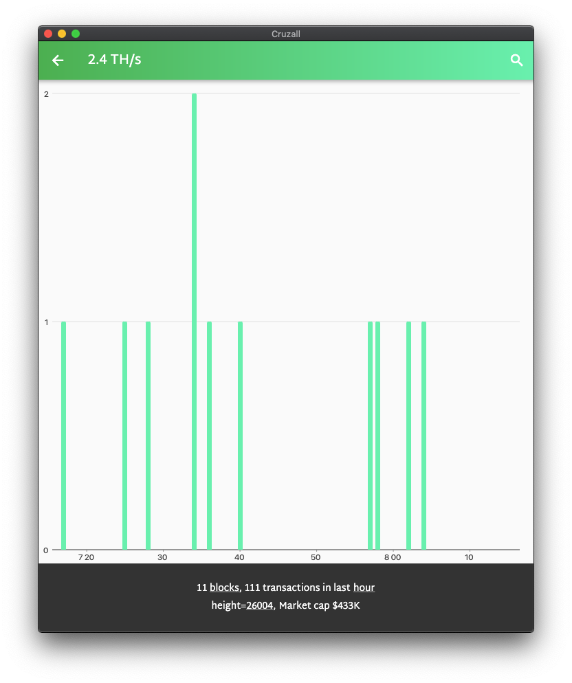

## Cruzall for macOS 1.1.2 
   See [parent project](https://github.com/GreenAppers/cruzall)
     

## Build
Follow the same procedure as [the continuous integration](https://github.com/GreenAppers/cruzall-macos/blob/master/.travis.yml)

## Project Map

## License

cruzall is released under the terms of the MIT license. See [LICENSE](https://github.com/GreenAppers/cruzall-macos/blob/master/LICENSE) for more information or see https://opensource.org/licenses/MIT.

## Discussion

* **[Discord server](https://discord.gg/MRrEHYw)** for general chat as well as updates, including development status.

## Donations

Right on!  [T83EkmIFNVJG+xK64Hm90GmQgrdR2V7BI=](https://www.cruzbase.com/#/address/RWEgB+NQs/T83EkmIFNVJG+xK64Hm90GmQgrdR2V7BI=)

